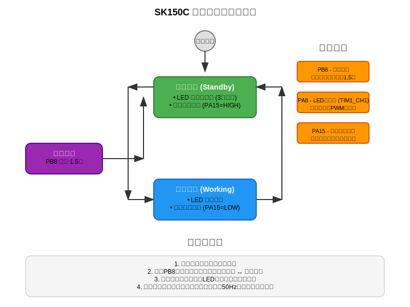

# SK150C Kit

SK150C adjustable power supply module control firmware, based on STM32G431CBU6 microcontroller implementing a complete power management solution.

## Project Description

The SK150C kit implements a complete control solution for adjustable power supply modules, including:

- Shell design
- Output PCB
- Input and control PCB
- MCU firmware

## Hardware Features

- **MCU**: STM32G431CBU6
- **USB PD input sink support**: Implemented through UCPD1 interface
- **Adjustable power supply module control**: Precise voltage and current control
- **USB-C output interface power control**: Intelligent output management
- **Voltage and status indicator LEDs**: Real-time status feedback
- **Power switch button input and status indication**: User interaction interface

## Functional Modules

- **USB PD protocol processing**: Support for PPS and fixed voltage requests
- **Voltage/current/temperature monitoring**: Real-time monitoring based on ADC
- **Power output control**: Intelligent output switch control
- **Button input management**: Multi-button input processing
- **Status indication control**: LED status indication
- **Software undervoltage protection**: Configurable protection mechanisms

## Hardware Connections (Based on sk150c-kit.ioc)

### Main Pin Configuration

- **PA0**: VOUT_SN (ADC1_IN1) - Output voltage detection
- **PA1**: VIN_SN (ADC2_IN2) - Input voltage detection
- **PA15**: VIN_CE (GPIO_Output) - Input control enable
- **PB5**: VBUS_CE (GPIO_Output) - VBUS control enable
- **PB7**: VBUS_LED (TIM4_CH2) - VBUS status LED
- **PA8**: POWER_LED (TIM1_CH1) - Power status LED
- **PB0**: NTC (ADC1_IN15) - Temperature detection

### USB PD Interface

- **PA9/PA10**: UCPD1_DBCC1/DBCC2 (Dead Battery)
- **PB4/PB6**: UCPD1_CC1/CC2 (USB PD communication)
- **PA11/PA12**: USB_DM/DP (USB communication)

### Debug Interface

- **PA13**: SWD_IO
- **PA14**: SWD_CLK
- **PA2/PA3**: USART2_TX/RX

## Software Architecture

- **[embassy-rs/embassy](https://github.com/embassy-rs/embassy)**: Async embedded framework
- **[usbpd](https://github.com/elagil/usbpd/tree/main)**: USB PD protocol stack
- **defmt**: Efficient embedded logging system

## Development Status

This is the preparatory work version before formal project development, completed:

- ✅ Basic hardware abstraction layer
- ✅ USB PD sink functionality
- ✅ ADC voltage/current/temperature monitoring
- ✅ Button input processing
- ✅ Power output control
- ✅ Software undervoltage protection
- ✅ **Power Management System** - Advanced power state control
- ✅ Removed display-related code
- ✅ Removed buzzer-related code
- ✅ Removed gravity sensor-related code

## License

This project is licensed under the MIT License - see the [LICENSE](LICENSE) file for details.

## Documentation

- [SK150C Digital Power Supply Manual](docs/SK150C-Digital-Power-Supply-Manual.pdf)

## Power Management

The SK150C Kit features an advanced power management system that provides intelligent power state control with visual feedback.



### Features

- **Dual Power States**: Standby and Working modes with automatic state management
- **Visual Feedback**: LED breathing effect (3-second cycle) in standby mode
- **Smart Control**: Long-press button detection (1.5 seconds) for state switching
- **Hardware Integration**: Synchronized control of LED indicators and power switches

### Hardware Connections

| Pin | Function | Configuration | Description |
|-----|----------|---------------|-------------|
| **PB8** | Power Button | Input, High-active | Long press (1.5s) to toggle power states |
| **PA8** | LED Indicator | PWM Output (TIM1_CH1), Open-drain | Breathing effect in standby, off in working mode |
| **PA15** | Power Switch Control | Output | Low=switch closed, High=switch open |

### Operation

1. **System Startup**: Automatically enters standby mode
2. **Standby Mode**:
   - LED shows breathing effect (3-second cycle)
   - Power switch is open (PA15=HIGH)
3. **Working Mode**:
   - LED is completely off
   - Power switch is closed (PA15=LOW)
4. **State Switching**: Long press PB8 button to toggle between modes

### Implementation Details

- **State Machine**: Clean separation between standby and working states
- **Breathing Algorithm**: Smooth sinusoidal PWM control at 50Hz update rate
- **Button Handling**: Debounced long-press detection with 1.5-second threshold
- **Synchronization**: Atomic state updates ensure consistent hardware control

## Getting Started

For detailed development instructions, see [DEVELOPER_GUIDE.md](DEVELOPER_GUIDE.md).

### Quick Build

```bash
# Setup development environment
make setup

# Build the project
make build

# Flash to device
make flash
```

## Contributing

1. Fork the project
2. Create a feature branch
3. Commit your changes
4. Create a Pull Request
5. Wait for code review

## Hardware Design

The project includes complete hardware design files in the `models/` directory:

- 3D printable shell models (STEP format)
- FreeCAD source files
- Assembly instructions

For detailed information about the hardware design, see [models/README.md](models/README.md).

---

*For Chinese documentation, see README.zh.md*