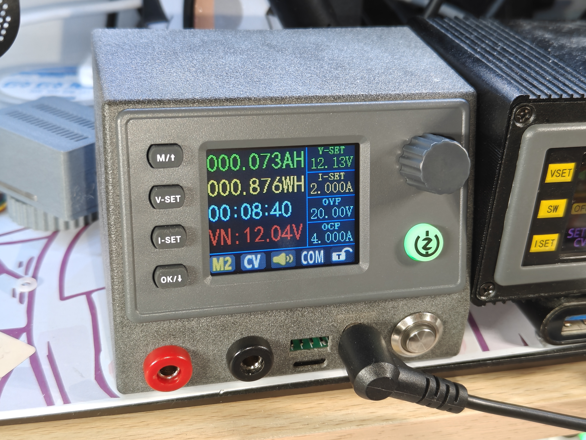
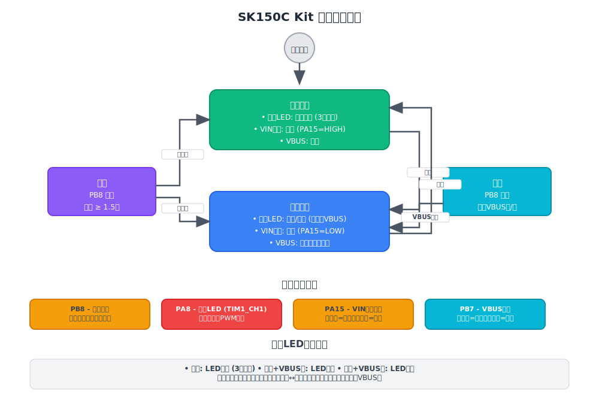
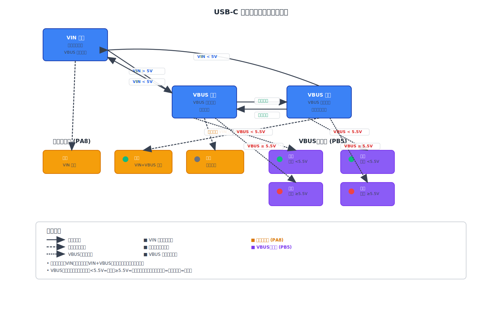

# SK150C Kit

SK150C 可调电源模块控制固件，基于 STM32G431CBU6 微控制器实现完整的电源管理方案。

## 项目描述

SK150C 套件实现了可调电源模块的完整控制方案，包括：

- 机壳设计
- 输出 PCB
- 输入与控制 PCB
- MCU 固件

## 产品概览



## 硬件特性

- **MCU**: STM32G431CBU6
- **USB PD 输入 sink 支持**: 通过 UCPD1 接口实现
- **可调电源模块供电控制**: 精确的电压和电流控制
- **USB-C 输出接口电源控制**: 智能输出管理
- **电压与状态指示 LED**: 实时状态反馈
- **电源开关按键输入与状态指示**: 用户交互界面

## 功能模块

- **USB PD 协议处理**: 支持 PPS 和固定电压请求
- **电压/电流/温度监测**: 基于 ADC 的实时监测
- **电源输出控制**: 智能输出开关控制
- **USB-C 电源输出开关控制**: 智能 VBUS 开关管理和电压指示
- **按键输入管理**: 多按键输入处理
- **状态指示控制**: LED 状态指示
- **软件欠压保护**: 可配置的保护机制

## 硬件连接 (基于 sk150c-kit.ioc)

### 主要引脚配置

- **PA0**: VOUT_SN (ADC1_IN1) - 输出电压检测 (VBUS)
- **PA1**: VIN_SN (ADC2_IN2) - 输入电压检测 (VIN)
- **PA15**: VIN_CE (GPIO_Output) - 输入控制使能
- **PB5**: VBUS_LED (GPIO_Output) - VBUS 双色 LED 控制
- **PB7**: VBUS_EN (GPIO_Output) - VBUS 开关控制
- **PB8**: POWER_KEY (GPIO_Input) - 电源按键输入
- **PA8**: POWER_LED (TIM1_CH1) - 电源状态LED
- **PB0**: NTC (ADC1_IN15) - 温度检测

### USB PD 接口

- **PA9/PA10**: UCPD1_DBCC1/DBCC2 (Dead Battery)
- **PB4/PB6**: UCPD1_CC1/CC2 (USB PD通信)
- **PA11/PA12**: USB_DM/DP (USB通信)

### 调试接口

- **PA13**: SWD_IO
- **PA14**: SWD_CLK
- **PA2/PA3**: USART2_TX/RX

## 软件架构

- **[embassy-rs/embassy](https://github.com/embassy-rs/embassy)**: 异步嵌入式框架
- **[usbpd](https://github.com/elagil/usbpd/tree/main)**: USB PD 协议栈
- **defmt**: 高效的嵌入式日志系统

## 开发状态

这是项目正式开发前的准备工作版本，已完成：

- ✅ 基础硬件抽象层
- ✅ USB PD 接收器功能
- ✅ ADC 电压/电流/温度监测
- ✅ 按键输入处理
- ✅ 电源输出控制
- ✅ 软件欠压保护
- ✅ **电源管理系统** - 高级电源状态控制
- ✅ **USB-C 电源输出开关控制** - 智能 VBUS 开关管理和电压指示
- ✅ 移除显示相关代码
- ✅ 移除蜂鸣器相关代码
- ✅ 移除重力传感器相关代码

## 许可证

本项目采用 MIT 许可证 - 详见 [LICENSE](LICENSE) 文件。

## 文档

- [SK150C 数控升降压电源说明书](docs/SK150C-Digital-Power-Supply-Manual.pdf)

## 电源管理

SK150C Kit 具有先进的电源管理系统，提供智能电源状态控制和视觉反馈。



### 特性

- **双电源状态**: 待机和工作模式，具有自动状态管理
- **视觉反馈**: 待机模式下的 LED 呼吸效果（3秒周期）
- **智能控制**: 长按按钮检测（1.5秒）进行状态切换
- **硬件集成**: LED 指示器和电源开关的同步控制

### 硬件连接

| 引脚 | 功能 | 配置 | 描述 |
|-----|----------|---------------|-------------|
| **PB8** | 电源按钮 | 输入，高电平有效 | 长按（1.5秒）切换电源状态 |
| **PA8** | LED 指示器 | PWM 输出 (TIM1_CH1)，开漏 | 待机时呼吸，工作时常亮/熄灭 |
| **PA15** | 电源开关控制 | 输出 | 低电平=开关闭合，高电平=开关断开 |

### 操作

1. **系统启动**: 自动进入待机模式
2. **待机模式**:
   - LED 显示呼吸效果（3秒周期）
   - 电源开关断开 (PA15=HIGH)
   - VBUS 输出禁用
3. **工作模式**:
   - LED 状态取决于 VBUS 状态：
     - **VBUS 启用**: LED 常亮
     - **VBUS 禁用**: LED 熄灭
   - 电源开关闭合 (PA15=LOW)
   - 可通过短按按钮切换 VBUS
4. **状态切换**: 长按 PB8 按钮在模式间切换

### 实现细节

- **状态机**: 待机和工作状态的清晰分离
- **呼吸算法**: 50Hz 更新频率的平滑正弦 PWM 控制
- **按钮处理**: 带有 1.5 秒阈值的防抖长按检测
- **同步**: 原子状态更新确保一致的硬件控制

## USB-C 电源输出开关控制功能

### 硬件接口定义

系统具有两套独立的 LED 指示灯系统：

#### 电源指示灯系统 (PA8 - POWER_LED)
- **功能**：整体系统电源状态指示
- **控制方式**：PWM 呼吸灯效果
- **硬件连接**：开漏输出，低电平点亮 LED

**电源指示灯状态**：

- **呼吸模式**：系统处于待机状态 - LED 以 3 秒周期呼吸闪烁
- **常亮模式**：系统处于工作状态 + VBUS 启用 - LED 持续点亮
- **熄灭模式**：系统处于工作状态 + VBUS 禁用 - LED 熄灭

#### VBUS 指示灯系统 (PB5 - VBUS_LED)
- **功能**：USB-C 输出电压和状态指示
- **控制方式**：GPIO 输出控制双色 LED
- **硬件连接**：3V3 → 电阻 → 绿色 LED → PB5 → 红色 LED → 电阻 → GND

**VBUS 指示灯状态**：
- **绿灯闪烁**：VBUS 关闭 + 电压 < 5.5V
- **绿灯常亮**：VBUS 开启 + 电压 < 5.5V
- **红灯闪烁**：VBUS 关闭 + 电压 ≥ 5.5V
- **红灯常亮**：VBUS 开启 + 电压 ≥ 5.5V

#### USB-C 电源开关控制 (PB7 - VBUS_EN)
- **功能**：控制 USB-C 电源输出
- **默认状态**：关闭（VBUS_EN 输出低电平）
- **切换条件**：短按电源按键 (PB8)
- **重置条件**：当 VIN < 5V 时强制重置为关闭

#### 输入信号
- **VIN (PA1)**: 输入电源检测，阈值 5V
- **VBUS (PA0)**: USB-C 输出电压检测，阈值 5.5V
- **POWER_KEY (PB8)**: 电源按键输入，用于状态控制

### 完整系统状态机



SK150C Kit 实现了一个综合的状态机，管理所有系统组件及其交互，包括：

- **系统状态**: 待机和工作模式，具有适当的状态转换
- **电源 LED 控制**: 待机时呼吸，工作模式下根据 VBUS 状态常亮/熄灭
- **VBUS LED 系统**: 基于电压的双色 LED 指示
- **按钮输入系统**: 防抖输入，支持短按/长按检测
- **安全与保护**: 欠压保护和自动 VBUS 禁用

## 快速开始

详细的开发说明请参见 [DEVELOPER_GUIDE.md](DEVELOPER_GUIDE.md)。

### 快速构建

```bash
# 构建项目
make build

# 烧录到设备
make flash

# 查看更多命令：
make help
```

## 贡献

1. Fork 项目
2. 创建功能分支
3. 提交更改
4. 创建 Pull Request
5. 等待代码审查

## 硬件设计

项目在 `models/` 目录中包含完整的硬件设计文件：

- 3D 可打印外壳模型（STEP 格式）
- FreeCAD 源文件
- 装配说明

有关硬件设计的详细信息，请参见 [models/README.md](models/README.md)。

---

*英文文档请参见 README.md*
