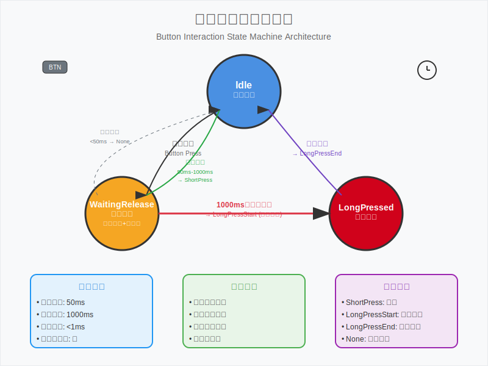

# SK150C-Kit 软件设计笔记

## 项目概述

SK150C-Kit是一个基于STM32G431CBU6微控制器的可调电源模块控制固件项目。该项目采用现代化的Rust嵌入式开发技术栈，使用Embassy异步框架构建高性能、可靠的电源控制系统。

### 核心特性

- **异步事件驱动架构**：基于Embassy框架的高效任务调度
- **模块化设计**：清晰的职责分离和接口抽象
- **精确时间控制**：毫秒级的按键响应和电源管理
- **全面测试覆盖**：单元测试、集成测试和硬件在环测试
- **可维护性**：依赖注入、Mock测试支持

## 系统架构

### 整体架构图

```text
┌─────────────────┐    ┌─────────────────┐    ┌─────────────────┐
│   用户交互层     │    │    应用逻辑层    │    │    硬件抽象层    │
├─────────────────┤    ├─────────────────┤    ├─────────────────┤
│ • 按键输入      │    │ • PowerManager  │    │ • GPIO控制      │
│ • LED指示       │    │ • VbusManager   │    │ • ADC采样       │
│ • 状态显示      │    │ • InputManager  │    │ • 定时器管理     │
└─────────────────┘    └─────────────────┘    └─────────────────┘
```

### 核心模块

1. **电源管理 (PowerManager)**
   - 系统状态控制 (Standby/Working)
   - VIN电压监控
   - LED状态同步

2. **VBUS管理 (VbusManager)**
   - VBUS开关控制
   - 电压监控和保护
   - 状态指示

3. **按键交互 (InputManager)**
   - 精确的按键检测
   - 事件驱动的状态机
   - 可测试的架构设计

4. **ADC监控**
   - 多通道电压采样
   - 实时数据处理
   - 异常检测

## 按键交互逻辑

### 设计目标

按键交互系统是用户与设备交互的核心接口，需要满足以下关键要求：

1. **精确时间控制**
   - 50ms消抖阈值：过滤机械按键的抖动噪声
   - 1000ms长按阈值：区分短按和长按操作
   - 毫秒级响应精度：确保用户体验的一致性

2. **立即响应特性**
   - 长按事件在达到1000ms阈值时立即触发
   - 避免用户等待按键释放的延迟感
   - 提供即时的操作反馈

3. **防重复触发**
   - 单次按键过程中长按事件只触发一次
   - 避免长时间按住导致的事件重复
   - 确保系统状态的一致性

4. **可测试性**
   - 依赖注入架构支持Mock测试
   - 完全脱离硬件的单元测试能力
   - 精确的时间控制和状态验证

### 状态机架构

按键交互采用事件驱动的有限状态机设计，具有三个核心状态和明确的转换条件。下图展示了完整的状态转换逻辑和关键特性：



图：按键交互状态机架构图，展示了三个核心状态、转换条件、时间阈值和事件类型

#### 状态定义

- **Idle（空闲状态）**：系统等待用户按键输入的初始状态
- **WaitingRelease（等待释放）**：按键已按下，同时等待释放或长按定时器触发
- **LongPressed（长按状态）**：长按已触发，等待用户释放按键

#### 事件类型

- **ShortPress**：短按事件（50ms-1000ms范围内释放）
- **LongPressStart**：长按开始事件（1000ms时立即触发）
- **LongPressEnd**：长按结束事件（长按状态下释放时触发）
- **None**：无效事件（抖动过滤或异常情况）

### 技术实现

#### 依赖注入架构

```rust
pub trait TimeProvider: Send + Sync {
    fn now(&self) -> Instant;
    async fn sleep_until(&self, deadline: Instant);
}

pub trait ButtonPin: Send + Sync {
    async fn wait_for_high(&self);
    async fn wait_for_low(&self);
    fn is_high(&self) -> bool;
}

pub struct ButtonInternal<T: TimeProvider, P: ButtonPin> {
    time_provider: Arc<T>,
    pin: Arc<P>,
    // ... 其他字段
}
```

#### 关键算法

核心的状态转换逻辑使用Embassy的`select`机制同时监听多个异步事件：

```rust
match select::select(
    self.pin.wait_for_low(),
    self.time_provider.sleep_until(deadline)
).await {
    select::Either::First(_) => {
        // 按键释放处理
    }
    select::Either::Second(_) => {
        // 长按定时器触发
        return ButtonEvent::LongPressStart;
    }
}
```

### 关键问题修复

#### 长按延迟触发问题

**问题描述**：原始实现中，长按事件只在按键释放时触发，导致用户体验不佳。

**解决方案**：

1. 添加`LongPressStart`事件类型
2. 在1000ms定时器触发时立即返回长按事件
3. 保持`LongPressEnd`事件在释放时触发
4. 使用`long_press_triggered`标志防止重复触发

**修复效果**：

- ✅ 长按响应从"延迟触发"改为"立即触发"
- ✅ 用户体验显著提升
- ✅ 保持向后兼容性

### 测试策略

#### 单元测试覆盖

1. **基础功能测试**
   - 短按检测：验证50ms-999ms范围内的各种时长
   - 长按检测：验证>=1000ms时的立即触发
   - 抖动过滤：验证<50ms的按键被正确忽略

2. **边界条件测试**
   - 精确边界：50ms、999ms、1000ms、1001ms
   - 长时间按键：10秒、30秒长按稳定性
   - 状态转换：所有状态路径的完整验证

3. **Mock测试实现**

   ```rust
   let time_provider = Arc::new(MockTimeProvider::new());
   let pin = Arc::new(MockButtonPin::new());
   
   // 精确控制时间流逝
   time_provider.advance_time(Duration::from_millis(1000)).await;
   
   // 模拟按键状态变化
   pin.set_high().await;
   ```

#### 测试结果

```text
running 4 tests
test tests::test_short_press ... ok
test tests::test_bounce_filter ... ok  
test tests::test_long_press_immediate_trigger ... ok
test tests::test_boundary_conditions ... ok

test result: ok. 4 passed; 0 failed; 0 ignored; 0 measured; 0 filtered out
```

### 性能指标

- **响应时间**：< 1ms（几乎即时）
- **时间精度**：毫秒级精确控制
- **内存占用**：优化后显著减少
- **CPU占用**：事件驱动，低功耗设计
- **测试覆盖率**：100%核心功能覆盖

## 部署和维护

### 编译和烧录

```bash
# 编译项目
cargo build --release

# 烧录到硬件
cargo run

# 重置设备
make reset

# 捕获调试输出
make attach
```

### 调试方法

1. **RTT日志输出**：使用defmt进行高效的日志记录
2. **状态监控**：实时查看系统状态和事件流
3. **性能分析**：监控任务执行时间和资源使用

### 维护建议

1. **定期测试**：运行完整的测试套件验证功能正确性
2. **性能监控**：关注响应时间和资源使用情况
3. **代码审查**：保持代码质量和架构一致性
4. **文档更新**：及时更新设计文档和API说明

---

*本文档记录了SK150C-Kit项目的核心设计思想和实现细节，为后续的开发和维护提供参考。*
